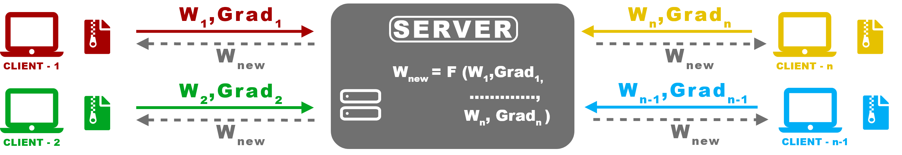
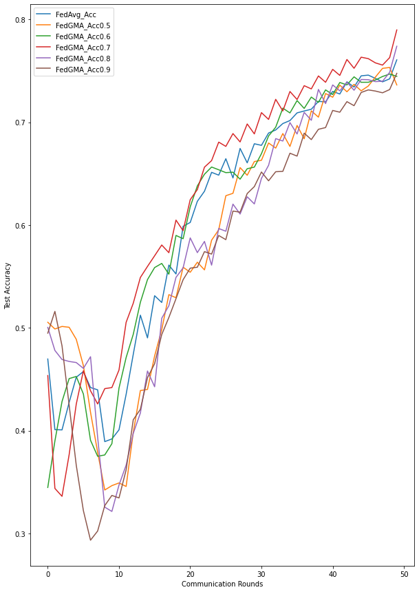

# FedGMA

**:exclamation: Disclaimer: This is not the official implementation of FedGMA** <br> <br>

This work is inspired by the intuitive approach used in [Gradient-Masked Federated Learning](https://github.com/siddarth-c/FedGMA/blob/main/GRADIENT-MASKED%20FEDERATED%20OPTIMIZATION.pdf). FedGMA is a modified version of FedAvg that ensures better convergence of server model, especially in the case of NIID data.

- [FedAvg and FedGMA](#fedavg-and-FedGMA)
- [Dataset](#dataset)
- [Results and Observation](#results-and-observation)
- [To Run](#to-run)
- [Citation](#citation)

## FedAvg and FedGMA
Federated learning (also known as collaborative learning) is a machine learning technique that trains an algorithm across multiple decentralized edge devices or servers holding local data samples, without exchanging them. This approach stands in contrast to traditional centralized machine learning techniques where all the local datasets are uploaded to one server, as well as to more classical decentralized approaches which often assume that local data samples are identically distributed. (Wikipedia) <br>



<br> FedAvg, or Federated Average, is one of such algorithms introduced by Google in 2017. It is the first ever FL algorithm, and achieved high-quality models using relatively few rounds of communication. For more info on FedAvg, refer to [Communication-Efficient Learning of Deep Networks from Decentralized Data](https://arxiv.org/pdf/1602.05629.pdf)
Comparitevly FedGMA is a new idea that uses a AND-Masked gradient update along with parameter averaging to ensure update steps in the direction of the optimal minima across
clients. 

## Dataset
The authors of the paper use the [MNIST](http://yann.lecun.com/exdb/mnist/) dataset to test their proposed work. It contains 60,000 training images and 10,000 testing images. The numbers are color coded with a self-induced noise. For more info, refer to the FedGMA paper and section 5.2 in the paper [Invariant Risk Minimization
](https://arxiv.org/pdf/1907.02893.pdf).

## Results and Observation
Note that a probability threshold of 0.7 achieves the maximum accuracy at the end of 50 communication rounds. Indeed the accuracy of 0.7 model is consistantly higher than other models through out the graph. <br><br>

<br> Note that there is an initial dip in the performance of all the models before rising. One possible explaination could be the way the model learns. The model could have learnt the classification via 2 different features:
1. Based on colour - Classiying based on colour would be the easiest. But due to the induced errors, this would not be the ideal solution
2. Based on integers - Classying the images based on the pixel locations, which is compartively tough, would be the ideal solution
To speculate, the model could have chosen the easier way at the begininig of classying by colour (local minima), but later realize that this is not the best solution and begins learning it based in the integers itself (global minima). 

Please note that there are a few implementation differences from the paper, optimizers and learning rate to name a few. Though the hyperparameters vary, the core idea is the same. <br> <br> 

## To Run
To run the code, follow the following steps:
1. Download the MNIST data from [here](http://yann.lecun.com/exdb/mnist/)
2. Extract the downloaded zip files into a new folder in the root directory titled 'samples'
3. Download [DataDistributor.py](https://github.com/siddarth-c/FedGMA/blob/main/DataDistributor.py) in the root directoy and run it
4. Download the [FedGMA.py](https://github.com/siddarth-c/FedGMA/blob/main/FedGMA.py) in the root directory and run it

## Citation
```
@article{Tenison2021GradientMF,
  title={Gradient Masked Federated Optimization},
  author={Irene Tenison and Sreya Francis and I. Rish},
  journal={ArXiv},
  year={2021},
  volume={abs/2104.10322}
  
  @inproceedings{McMahan2017CommunicationEfficientLO,
  title={Communication-Efficient Learning of Deep Networks from Decentralized Data},
  author={H. B. McMahan and Eider Moore and D. Ramage and S. Hampson and B. A. Y. Arcas},
  booktitle={AISTATS},
  year={2017}
}

@article{Ahuja2020InvariantRM,
  title={Invariant Risk Minimization Games},
  author={Kartik Ahuja and Karthikeyan Shanmugam and K. Varshney and Amit Dhurandhar},
  journal={ArXiv},
  year={2020},
  volume={abs/2002.04692}
}
}


```
